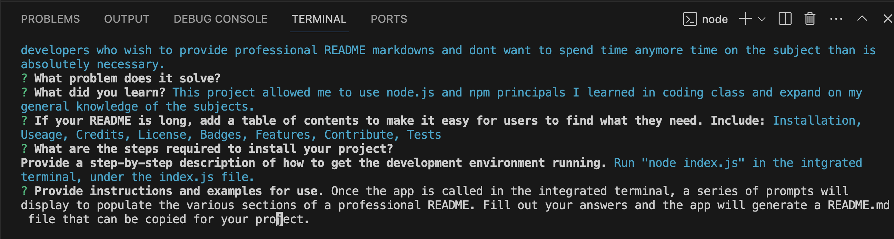

#undefined

## Description

This project allows for quick and easy README markdown generation.

README sections can be tedeious and laborious and becuase of this fact sometimes they lack critical components. This app makes README markdown generation quick and easy and, most importantly, makes sure all of the crutil information is included in a professional final product.

This app is important to developers who wish to provide professional README markdowns and dont want to spend time anymore time on the subject than is absolutely necessary.

This project allowed me to use node.js and npm principals I learned in coding class and expand on my general knowledge of the subjects.

## Table of Contents

- [Installation](#Installation)
- [Useage](#Useage)
- [Credits](#Credits)
- [License](#License)
- [Badges](#Badges)
- [Features](#Features)
- [Contribute](#Contribute)
- [Tests](#Tests)

## Installation

Run "node index.js" in the intgrated terminal, under the index.js file.

## Useage

Once the app is called in the integrated terminal, a series of prompts will display to populate the various sections of a professional README. Fill out your answers and the app will generate a README.md file that can be copied for your project.

## Credits

Thank you to Sasha and Roger for the instruction that allowed me to complete this project.

## License

MIT License

## Badges

No Badges

## Features

## Contribute

See the questions section and e-mail me.
## Tests

## Questions

github.com/coulterkyle

e-mailkcoulter2002@gmail.com
